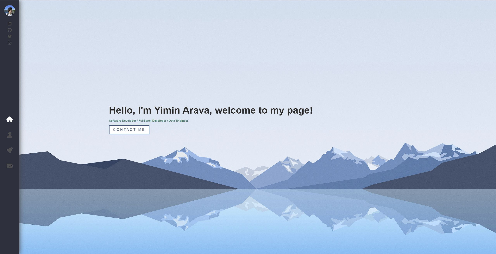

# My Portfolio Website
<p align='center'>
  <a href = 'https://yiminarava4508.github.io/Pages/'>
    
  </a>
</p>

<details open="open">
  <summary>Table of Contents</summary>
  <ol>
    <li><a href="#about">About</a></li>
    <li><a href="#prerequisites">Prerequisites</a></li>
    <li><a href="#quickstart">Quickstart</a></li>
    <li><a href="#details">Details</a></li>
    <li><a href="#deployment">Deployment</a></li>
  </ol>
</details>

## About
I created a React app to serve as my portfolio website! This Website is hosted at https://yiminarava4508.github.io/Pages/

I'm working actively on this to add more features. There will be a section that displays my work experience and my downloadable resume in the future.

## Prerequisites
* [JavaScript](https://developer.mozilla.org/en-US/docs/Web/JavaScript)
* [React](https://react.dev/)
* [Email.js](https://https://www.emailjs.com/)
* [CSS](https://developer.mozilla.org/en-US/docs/Web/CSS)
* [GitHub Pages Site](https://docs.github.com/en/pages/getting-started-with-github-pages/creating-a-github-pages-site)

## Quickstart
In order to run the project locally you will need to clone this repository, then open up the files locally on your machine:

1. To run the app locally, make sure you are in the Pages directory, then type in the following commands in the terminal:
```
npm start
```

## Details

The navbar uses the free [Fontawesome Icons](https://fontawesome.com/) as icons.


Email.js is a service that allows emails to be send from server side javascript directly, I used it to set up the contact me page.


## Deployment
To deploy the app, you need to have a [GitHub Pages Site](https://docs.github.com/en/pages/getting-started-with-github-pages/creating-a-github-pages-site) ready for deployment, then use the following commands to build then deploy:
```
npm run build
```
```
npm run deploy
```
